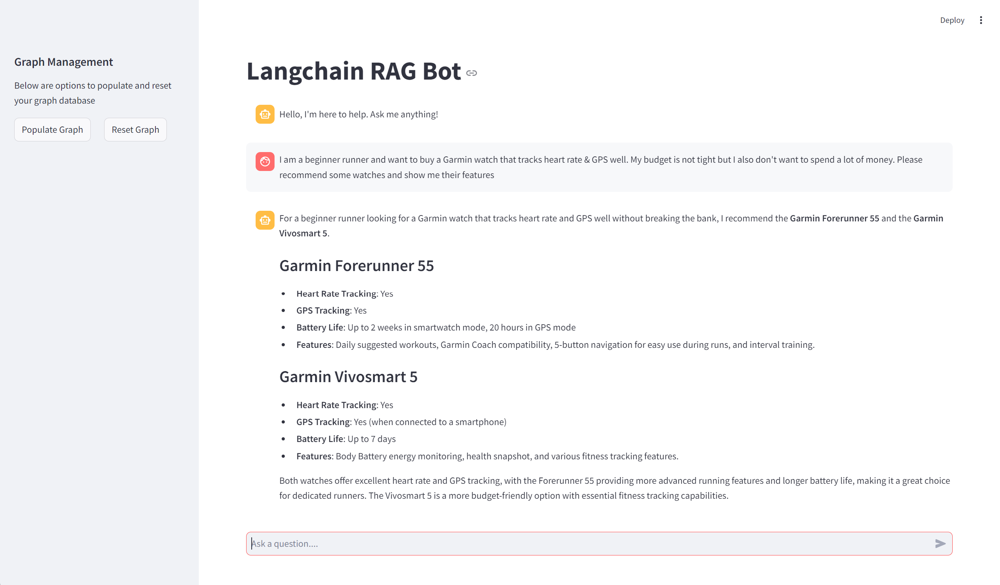
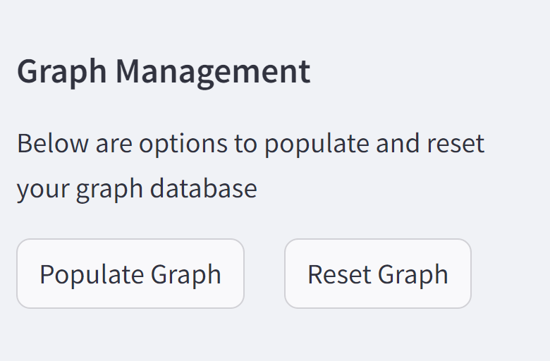

# Graph RAG
<p align="center">
  
</p>

This project implements **GraphRAG** using Neo4j and LangChain to provide a powerful retrieval-augmented generation system. It combines structured graph data with unstructured vector search for more accurate and context-aware responses.

## 🚀 Features
- **Multi-Source Extraction**: Automatically extracts and chunks content from:
  - YouTube video transcripts
  - Wikipedia articles
  - Local text files
- **Knowledge Graph Construction**: Uses OpenAI's GPT-4o to transform unstructured text into a Neo4j knowledge graph.
- **Hybrid Retrieval**: Combines:
  - **Vector Search**: Nearest neighbor search on document embeddings.
  - **Structured Search**: Full-text indexing and Cypher queries to navigate graph relationships.
- **Interactive UI**: A Streamlit chat interface for chatting with your knowledge base.

## 🏗️ Project Structure
```text
Graph_RAG/
├── graph_rag/
│   ├── app.py          # Streamlit UI & Application Entry
│   ├── graph.py        # Graph construction & data extraction (YouTube/Wiki/Text)
│   ├── rag.py          # RAG logic & Hybrid Retriever
│   ├── entities.py     # Data models for entity extraction
│   └── images/         # Project screenshots
├── pyproject.toml      # Dependency management (Poetry)
└── README.md           # Documentation
```

## 🛠️ Getting Started

### 1. Neo4j Docker Setup
The project requires a Neo4j instance with the **APOC** plugin.

1.  Download the [APOC plugin JAR](https://github.com/neo4j/apoc/releases/tag/5.20.0) for Neo4j 5.20.0.
2.  Run the following command to start Neo4j in Docker:

```bash
docker run \
    -p 7474:7474 -p 7687:7687 \
    -v ${PWD}/data:/data -v ${PWD}/plugins:/plugins \
    --name neo4j-v5-apoc \
    -e NEO4J_apoc_export_file_enabled=true \
    -e NEO4J_apoc_import_file_enabled=true \
    -e NEO4J_apoc_import_file_use_neo4j_config=true \
    -e NEO4J_PLUGINS='["apoc"]' \
    -e NEO4J_dbms_security_procedures_unrestricted="apoc.*" \
    neo4j:5.20.0
```

3.  Access the Neo4j Browser at `http://localhost:7474` and set your password to `buildkg123!` (or update the credentials in `graph_rag/app.py`).

### 2. Python Environment Setup
Install dependencies using [Poetry](https://python-poetry.org/):

```bash
poetry install
```

### 3. Run the App
**Ensure your `OPENAI_API_KEY` is set** (you can also edit the placeholder in `graph_rag/app.py`).

Run the Streamlit application:

```bash
poetry run streamlit run graph_rag/app.py
```

## 🧠 Usage
<p align="center">
  
</p>

1.  **Populate Graph**: Click the "Populate Graph" button in the sidebar. This will fetch content (defaulting to Garmin Forerunner/Fenix data) and build the graph.
2.  **Chat**: Once populated, you can ask questions about the ingested content in the chat interface.
3.  **Reset**: Use the "Reset Graph" button to clear the database and start over.
